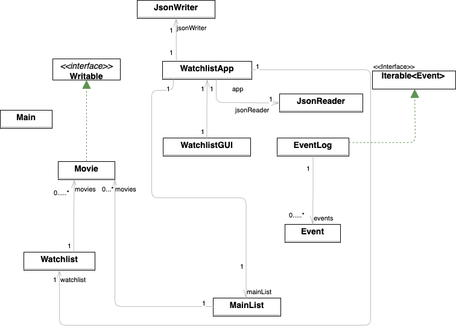

# Watchlist Manager

## Java Application for Managing Movies and Web Series

### What will the application do?

The Java application (Watchlist Manager) aims to help users organize and manage their movie and web series preferences. 
It would provide two main tabs: one for Movies and another for Web Series.
Users can suggest movies and web series to be added to the main list. 
They can then select from this list to create and customize their personal watchlist. 
The application will also include a feature to remove or add more movies or TV series to the watchlist and provides a convenient exit button for users to close the app.

### Who will use it?

This application will be intended for individuals who enjoy watching movies and web series and want a convenient way to keep track of their entertainment preferences. It caters to movie enthusiasts and binge-watchers who want a simple and user-friendly tool to manage their watchlist.

This project is of personal interest to me for several reasons:

- I've always preferred movies and series over books. I believe that having an organized watchlist enhances the overall viewing experience and ensures that I never miss out on the latest releases or recommendations from friends. 

- I see this project as an opportunity to apply my programming skills to create an application that aligns with my own interests and can also benefit others who also enjoy watching movies.

- Existing solutions for managing watchlists can be too complex sometimes. I'm excited about designing an application that is intuitive and simple.

### User Stories:

**For the Watchlist Manager:**

- As a user, I want to be able to suggest movies and web series to be added to the main list.

- As a user, I want to be able to create my watchlist by selecting items from the main list.

- As a user, I want to be able to view my watchlist.

- As a user, I want to be able to have the flexibility to remove movies or TV series from my watchlist.

- As a user, I want to be able to save my watchlist and view it later.

- As a user, I want an easy-to-use exit button to close the application when I'm done managing my watchlist.

## User Stories covered in Phase 1 of the project: 

- As a user, I want to be able to create my watchlist by selecting items from the main list.

- As a user, I want to be able to view my watchlist.

- As a user, I want to be able to have the flexibility to remove movies or TV series from my watchlist.
- 
- As a user, I want an easy-to-use exit button to close the application when I'm done managing my watchlist.

## User Stories covered in Phase 2 of the project:

- As a user, I want to be able to save my watchlist and main list.

- As a user, I want to be able to suggest movies to be added to the main list.

- As a user, I want to be able to load my watchlist and main list and view it later.

- As a user, I want to get an option to save my watchlist and main list when I try to exit the program.

## UML Diagram: 

